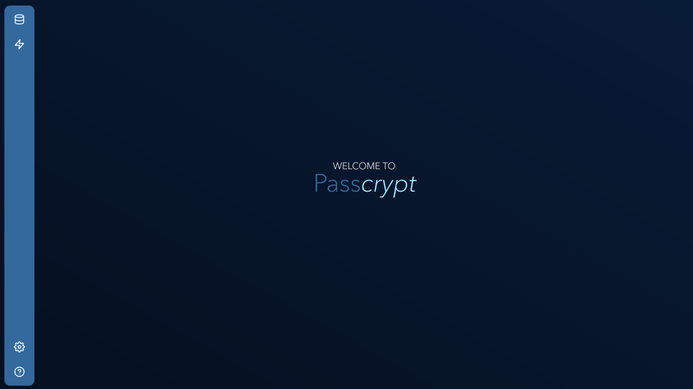
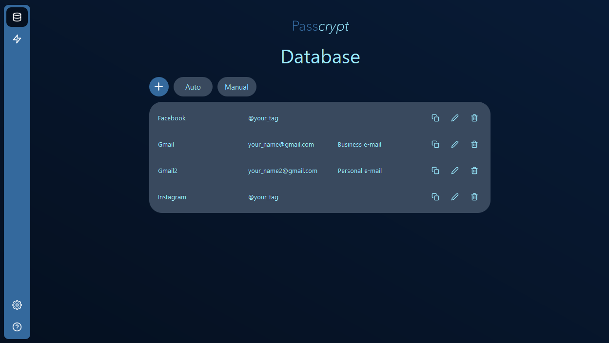
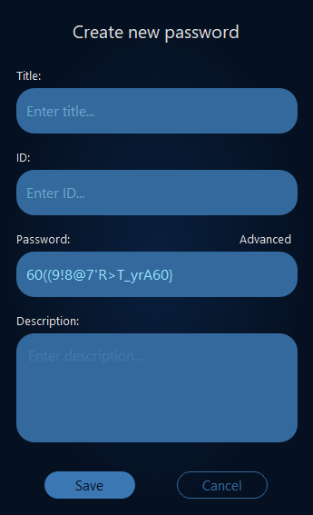
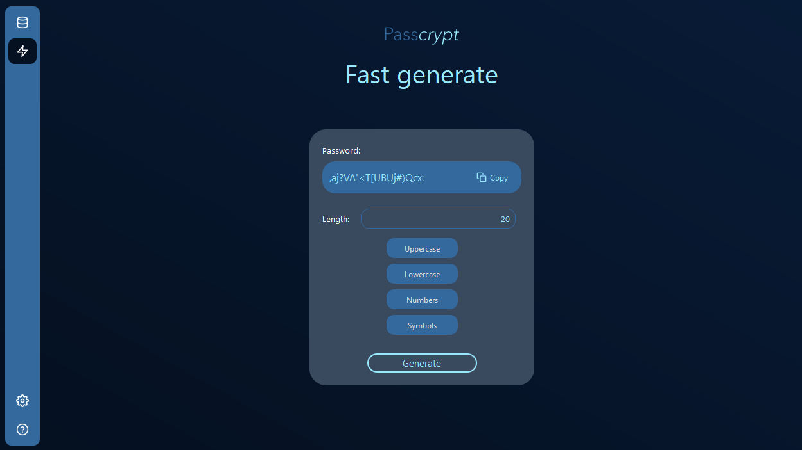

# Passcrypt

## Description

Passcrypt serves as a reliable password management solution meticulously crafted to safeguard your digital existence. The inspiration behind the development of this application stems from my commitment to preserving the security of valuable information. Recognizing the importance of maintaining a secure repository accessible only by the user, I designed Passcrypt to store passwords in an encrypted format on your local machine. This ensures that you have uninterrupted access to your passwords at any time, even offline. Most significantly, Passcrypt operates independently, eliminating dependence on external factors, thereby providing you with unparalleled control and security.

The project provided a holistic learning experience, encompassing programming proficiency, framework utilization, security considerations, and the importance of user independence and control in software design.

1. C++ Proficiency: The project involved a deep dive into C++ programming, enhancing proficiency in the language. This includes a solid understanding of object-oriented programming concepts, memory management, and low-level system interactions.

2. Qt Framework Mastery: Working with the Qt Framework provided insights into cross-platform application development. Learning to leverage Qt's libraries and tools facilitated the creation of a user-friendly interface and streamlined the development process.

3. Security Implementation: Developing a password manager required a thorough understanding of cryptographic techniques for data encryption. The process of securing sensitive information and ensuring robust protection against potential vulnerabilities was a significant learning aspect.

## Table of Contents

- [Installation](#installation)
- [Usage](#usage)
- [Features](#features)

## Installation

- installation instructions to be added

## Usage

- usage instructions and examples to be added

- image example: 

### 1. App flow

When starting the app you will be greeted with the home page, accessible only when opening the app. Then you can use the buttons in the side bar to navigate through the app and use its features.

### 2. Side bar

In the side bar you have 4 buttons:

- Database
- Fast generate
- Settings
- Help

### 3. Database

In the database page you can visualize your passwords in a table and copy, edit or delete them.
You can add a new password using ‘Auto’ or ‘Manual’ buttons. 
        
1. ‘Auto’ will automatically generate a new complex password that you can save to the database and immediately use it. In advanced section you can customize the way in which the password is generated (how many characters, which characters)
2. ‘Manual’ will provide you with a form similar to the one in ‘Auto’, except this time you will have to manually introduce a password.

### 4. Fast generate
In fast generate page you can generate passwords and copy them for immediate use.
These passwords will not be saved to the database.

### 5. Settings
    
In settings you can change your master password. You must enter your current master password and then enter your new password twice. After clicking 'Change password' the database will be encrypted with respect to your new master password and accessing the app will require you to remember your new master password.

## Security Features:

### Encryption:

Passcrypt uses the libsodium library for robust encryption, ensuring your data remains secure. The file where the passwords are save is encrypted and decrypted using an XChaCha20 key derivation, provided by the library.